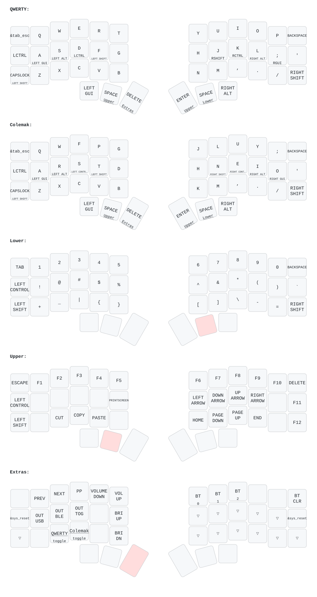

# Clover - Corne V3

ZMK config and relevant files for my custom built split mechanical keyboard.

This board is based on a popular split keyboard PCB shape called the Corne ([github.com/crkbd](https://github.com/foostan/crkbd)), which features 3x6 column staggered keys and 3 thumb keys on each side. It has 5 software layers (two base layouts plus three momentary layers) to access all the keys of a normal board as well as some custom macros. It runs as a three-piece split: a [Prospector](https://github.com/carrefinho/prospector) dongle is the central and both halves are peripherals, so the dongle must be plugged in for the keyboard to work. The main advantage of this design is that your fingers never need to leave the home row, meaning you can type faster and more comfortably, along with the massive benefit of being able to make more effective use of keyboard shortcuts. Being split, it also allows your arms to fall more naturally on the table - wherever you like. My(and some others) feeling is that all these seemingly insignificant tweaks add up to a decent improvement in efficiency and comfort over years spent typing.

#### Components

-   `MCU`: nRF52840 "pro micro" / SuperMini _nice!nano v2 compatible_ (wireless), one per half
-   `Dongle`: [Prospector](https://github.com/carrefinho/prospector) (Seeed XIAO nRF52840 + 1.69" LCD) acting as the split **central**
-   `PCB`: Standard [v3.0.1 Cherry-Corne](https://github.com/foostan/crkbd/blob/main/docs/corne-cherry/v3/buildguide_en.md) designs
-   `Case`: Corne v3 compatible case
-   `OLED`: 0.91" 128x32 I2C white OLEDS
-   `Batteries`: 18650 Li-ion (one per half)
-   `Sockets`: Hotswap sockets
-   `Diodes`: 1N4148W SMD Diode SOD-123
-   `Switches`: Gateron Low Profile (GLP / KS-33) | plate mount, MX 14x14 cutout
-   `Keycaps`: Low profile 1U

#### Software

Three-piece split running [ZMK](https://github.com/zmkfirmware/zmk) pinned to **v0.3**, with the
[prospector-zmk-module](https://github.com/carrefinho/prospector-zmk-module) for the dongle display.
The dongle is the central and holds the keymap; both halves are peripherals.

See [PROSPECTOR.md](PROSPECTOR.md) for the build/flash procedure and gotchas.

#### Keymap:

Layer order matters here: ZMK resolves a press from the highest active layer down, so the alternate
base (Colemak) sits **below** the momentary layers - otherwise it shadows them and you cannot leave it.

| # | Layer | Reached by |
| - | ----- | ---------- |
| 0 | QWERTY  | default base |
| 1 | Colemak | `&to 1` from Extras (left inner thumb + `C`) |
| 2 | Lower   | hold right thumb |
| 3 | Upper   | hold left/right thumb |
| 4 | Extras  | hold left inner thumb |

Output switching lives on the Extras home row: `A` = USB, `S` = Bluetooth, `D` = toggle, with
`Y`/`U` selecting the two Bluetooth host profiles.



> The diagram is generated from `config/clover_dongle.keymap` (the keymap actually flashed to the
> dongle). To regenerate after editing:
>
> ```sh
> uvx --from keymap-drawer keymap parse -z config/clover_dongle.keymap \
>   | sed 's|^layout: .*|layout: {qmk_keyboard: crkbd/rev1, layout: LAYOUT_split_3x6_3}|' \
>   > assets/keymap_parsed.yaml
> uvx --from keymap-drawer keymap -c assets/keymap draw assets/keymap_parsed.yaml > assets/keymap.svg
> ```

## Images

|           Corne v3            |            Photos             |
| :---------------------------: | :---------------------------: |
|  |  |
|  |  |
